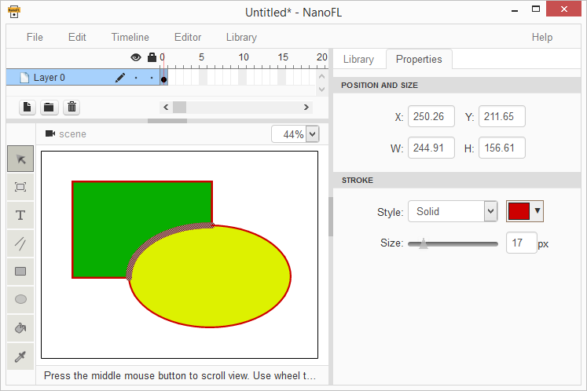
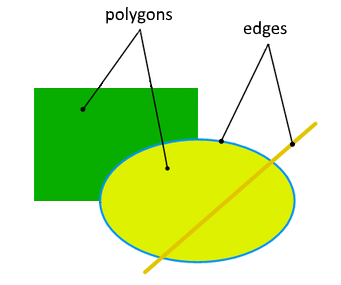
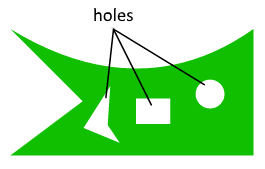
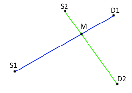
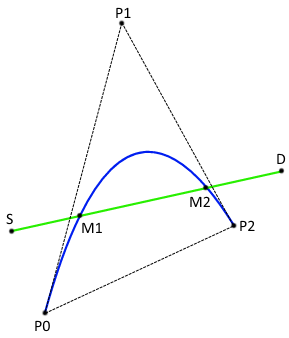
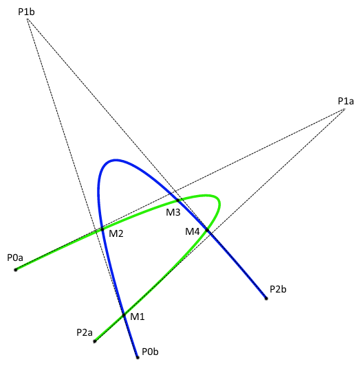
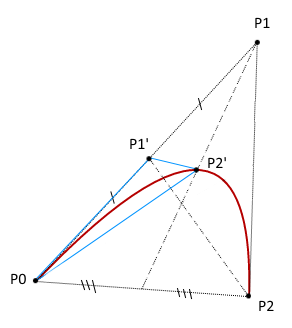

Calculate vector shapes union. Part 1
===============================================



A long time ago in a galaxy far, far away (ie more than a year ago, and outside of the default country)
one web developer decided to write a <a href="http://nanofl.com/">self-made Flash</a>
(he was not without delusions of grandeur, of course). The problem back then seemed difficult
and very interesting. This article will be about some issues that he met on this way.

Those who draw in Flash know that the shapes in it (filled areas)
within the same layer never overlap, and the lines are always 
drawn on top of the filled figures. This approach is, in my view, a nice plus -
you have an image that you can see. However, writing a vector editor leads to the necessity of solving the problem to calculate the union of the
drawable objects (lines, filled areas). Below I will try to show how it can be done step-by-step.

<div class="spoiler" style="margin-top:50px">
	This article is an attempt to describe the decision as the author sees it. Far from perfect. The author is grateful for helpful ideas about improving the algorithm.
</div>



For simplicity, further I will refer to filled areas bounded by straight lines and quadratic Bezier curves as <b>polygons</b>. As a rule, mentiontioning the <b>edges</b>, I will keep in mind the visible stroke straight or curved segments.


Initial data
------------
So, we have two images that we want to combine. Any given set of edges, and polygons.

Here's what we know about the edges:

 * it can be straight lines;
 * may be Bezier curves;
 * each edge has a different color;
 * no edges intersections (but edges can, of course, have a common start or end point).

So, on the right you can see the 5 edges: two blue and three dark yellow.

<div class="spoiler">Quadratic Bezier curve is the simplest case where the curve has a single control point and, in fact, is drawn inside the triangle given its three vertices. An excellent illustration from Wikipedia:</div>

What we know about the polygons:


 * limited by straight or curved segments;
 * never intersect;
 * can be adjacent to each other, i.e. have a common border (in this case, the fill colors should be different, or the boundary should be clearly separated edges, so that should not be polygons that nothing prevents combine into one);
 * they have their own version of the fill (in the simplest case - the color);
 * it may be transparent (using alpha-channel in color specification);
 * can be non-convex;
 * may have "holes" (that is, the area defined by straight/curved segments, where there is no filling).

In light of the fact that a polygon is a complex object, we shall describe it as a closed outer contour + set of unintersected inner contours (holes).


Subtasks
--------
It is clear that the presence of the union of two of vector images is a difficult task, therefore I will break it down into several sub-tasks. That's what I've got:

 * search the intersection of all segments of the first image and all segments of the second image and break segments by the found points;
 * search all contours (closed chain segments) on a combination of segments of two images;
 * determining the presence/absence and its fill color for each contour with respect to each of the two images;
 * removal of all edges of the original image, which is entirely get inside the filled area of the second (top) image;
 * remove polygons from the original (back) image available in the top image without regard to color;
 * adding to the edges of the original image and the polygons of polygon edges and overlay (with the matching edges of the original image edges overwritten overlay);
 * merge polygons from the original image having the same filling and without the explicit separation of edges.

As a result of all these actions in the original image, we can expect the desired result of the union.

I think it is clear that each of the subtasks is a sometimes non-trivial problem. Therefore, we will consider them separately.


Calculate the intersection point of two segments
------------------------------------------------

There are different kinds of the segments, so consider three possible cases separately.


### The two straight segments ###

As you know, finding the intersection of the two straight segments is not particularly difficult, we need only remember that for the calculations it is convenient to represent them in a parametric form (formula y = kx + b has a fatal flaw: low precision for nearly-vertical lines):


```js
// M - a point on the segment, S - the beginning of the segment,
// D - the end of the segment, t - value in the range [0; 1]
M1 = S1 + (D1-S1) * t1 // parametric representation of the first segment
M2 = S2 + (D2-S2) * t2 // parametric representation of the second segment

// Crossing - is when M1 = M2 - the system of equations,
// from which we 's get the value t1:
Xs1 + (Xd1-Xs1) * t1 = Xs2 + (Xd2-Xs2) * t2
Ys1 + (Yd1-Ys1) * t1 = Ys2 + (Yd2-Ys2) * t2
```

I will not describe the solving of the t1 (I think everyone can do it). After obtaining the values ​​t1 we need to ensure that it lies in the range [0; 1] (otherwise, the segments do not intersect), then it can substitute a formula defining a first section, thus obtaining coordinates of the points of intersection:

```js
Xm = Xs1 + (Xd1-Xs1) * t1
Ym = Ys1 + (Yd1-Ys1) * t1
```


### Bezier curve and a straight segment ###

The intersection of a Bezier curve and the straight segment is not so easy, but it is solved analytically, especially if we pre guess and rotate the segment and the curve so that the segment has become a strictly horizontal:


```js
// P0, P1, P2 - the point defining the curve; t - value in the range [0; 1];
// parametric representation of the curve:
M1 = (1-t1) ^ 2 * P0 + 2 * t1 * (1-t1) * P1 + t1 ^ 2 * P2 

// S - the beginning of the segment, D - end;
// parametric representation of the straight segment:
M2 = S + (D - S) * t2

// rotate points P0, P1, P2, S and D by the angle a = -atan2 (Yd-Ys, Xd-Xs);
// below are the known formulas for this rotate
// (point specified by (X, Y) became the point (Xn, Yn))
Xn = X*cos(a) - Y*sin(a)
Yn = X*sin(a) + Y*cos(a)

// formula of the curve has not changed (but values ​​P0, P1 and P2 are changed)
Xm1 = (1-t1)^2 * Xp0 + 2*t1*(1-t1) * Xp1 + t1^2 * Xp2
Ym1 = (1-t1)^2 * Yp0 + 2*t1*(1-t1) * Yp1 + t1^2 * Yp2

// formula of the straight segment became simpler for coordinate Y:
Xm2 = Xs + (Xd-Xs) * t2
Ym2 = Ys // since after the rotation we have Ys = Yd

// M1 = M2, т.е.
Xm1 = Xm2
Ym1 = Ym2

// enough to consider only the formula for Y,
// because that is where there is a simplification:
(1-t1)^2*Yp0 + 2*t1*(1-t1)*Yp1 + t1^2*Yp2 = Ys
```

Solving this quadratic equation, we find the value t1 (and there can be two). For each value of t1, as in the case of straight segments, it is necessary to make sure that it is in the range [0; 1]. Substituting the values ​​of t1 in the original (before rotation) the formula of the curve, we obtain the coordinates of the desired intersection points.


### Two Bezier curves ###

 Analytically calculate the point of intersection of two quadratic Bezier curves (there are up to 4 points) is not simple: the difficulty is so high that even the resentment comes MathCAD, giving out messages about too long formulas. Also, as far as I understand the situation, in this case, will have to work with complex numbers. Fortunately, there are numerical iterative methods for obtaining the points of intersection of arbitrary curves with a given accuracy. Everything is simple:

 1. If both current segments are smaller than the specified precision - approximate their by straight segments and calculate intersection point.
 2. If at least one of the segments more precision - we beat it in two (more or less equal) parts and recursively apply the algorithm to the received segments. 

Here you can do optimization: pre-check segments overlapping by bounding boxes and if no, then stop the current branch of recursion.


The moment, which can cause difficulty - a dividing a Bezier curve into two parts (ie, the calculation of new control points, to determine the end point of the first curve, which coincides with the start point of the second curve, easily substituting in the formula of the curve t = 0.5). As it turned out, it is sufficient to calculate the coordinates of the centers of segments of a predetermined reference triangle - result points are the control points of the new curves. Figure on the left illustrates the solution: curve (P0, P1, P2) is divided into two curves, the support of which a first triangle (P0, P1 ', P2') is highlighted in blue. The control point of the second curve (P2 ', ..., P2) is calculated similarly.

To be continued...

----------------------------------------------------------------------------------------------------

<a href="https://bitbucket.org/nanofl/site/src/default/docs/articles/combine_shapes_1/index.md" target="_blank">Edit this page at bitbucket</a>