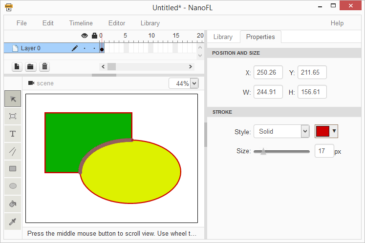
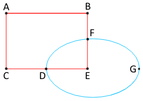
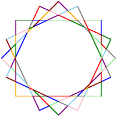
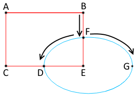
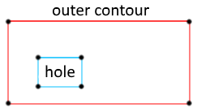
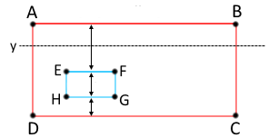
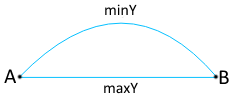
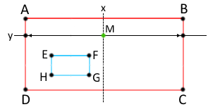

Calculate vector shapes union. Part 2
=====================================

In the <a href="/docs/articles/combine_shapes_1/">previous article</a>,
we broke down all available segments by the points of intersections, 
guaranteeing in this way we did not have intersecting segments any more. 
In this part we will join result segments into contours and determine their filling.


Determine contours
------------------


So we have a set of not intersecting segments.
Let's look for contours which will prove useful for polygons detection.
At the figure on the right, we can see 6 red and 3 blue segments.
It would be well to find contours ABFDC, DFE, and FGD.
Composite contours (for example, ABFGDC) do not interest us and so either
our algorithm must not stumble across them or we will have to exclude these contours later.


### Searching by brute force

The first algorithm that came to my mind originally proved itself well. That is how it looks:

1. For simplicity, we double the number of segments, adding for each segment of its inversely directional clone (it will allow us to walk across segments as over vectors, go without needing to go to back).
2. We sequentially take each segment as initial for contour, it is placed to a new array and recursively call search procedure (see below).
3. Now, iterate all segments to find such segment, which start point match the last found segment and its end point was yet found among points of segments in the array, and add that segment into the array.
4. If the end of this segment match the start of the first segment of an array – we found contour and can add an array of segments to an array of found contours and go out of the recursion.
5. If not - recursively call a procedure to search the next segment.




If we add to this algorithm a procedure to exclude the composite contours,
we get something operable enough. And I thought everything was good,
until I have been faced with a real situation (see figures).
Pay attention towards the yellow "star" in a chain of a famous character.
It is drawn by an overlay of a lot of squares turned around their center.
After breaking segments by the intersection point, we will have 112 ones.
I could not wait for the end of the procedure on this image.
And, really, the time of searching by combining so many segments is O(n!),
which, as you understand, is normal for ten segments,
but absolutely unacceptable to hundred ones.
I had to think about the other algorithm.


### The directional search by the detecting a "best" segment to go to


Let's go back to the original figure (it be duplicated on the left).
If we (during searching the next segment for a contour) became by a vector from a point B to F,
then we may go to D or G, because moving by FE vector,
we will obviously choose a segment belonging to a compound contour!
I.e. we can strongly decrease the searching by brute force (now, from each point we can go maximum by two paths).
And let's think about it, although well, further.
The above search algorithm will be noticed to find all contours two times
(one time - when moving around contour's segments clockwise and another time – counterclockwise).
What if in each branch we choose only a "best" segment in sense of a motion clockwise?
(At figure: if the last vector was BF, then the next will be FD.)
So, we find all necessary contours! Without a recursion! Miracle!

Minor warning: although we are going clockwise, sometimes we will find counterclockwise contours,
if the starting vector does not belong to any clockwise  contour.
In addition, these counterclockwise contours can be compound
(look at the figure: the AB vector belongs to the clockwise contour ABFDC – and here is a BA vector – the compound counterclockwise contour BACDGF).
And so we will need to exclude all counterclockwise contours from a resulting array.

To determine the contour is clockwise (here (x1,y2) – a startpoint of a vector, (x3,y3) – is endpoint):

```haxe
function isClockwise()
{
	var sum = 0.0;
	for (edge in edges)
	{
		sum += (edge.x3 - edge.x1) * (edge.y3 + edge.y1);
	}
	return sum >= 0;
}
```
That algorithm works with acceptable speed (around O(n^2)), as far as I understand,
and he is excellently proving himself on real tasks. And we are going further.


Construct polygons by found contours
------------------------------------

So we have contours. It is time to group them into polygons
(please, recall the polygon is an outer contour + a set of inner contours-"holes").

The problem is being well solved directly:

1. Sequentially take each contour as an outer contour of future polygon.
2. Search  among the remained contours those, which lie inside our outer contour.
3. Take a point lying inside an outer contour, but beyond boundaries of its "holes".
4. In an bottom image we take a fill in this point (i.e. we are looking for the polygon to which it belongs) and, if such a polygon is found, add an outer contour+"holes" as a new polygon to an array of the found polygons for an original image.
5. Do the same for a top image (we look for the polygon to which the point belongs and, if it is found, we add a new polygon to an array of the found for a top image).

In this way we "reconstruct" an bottom and top image after an intersection of all segments.
We were guaranteed, in addition, to have now as each of the polygons of a bottom image coinciding with
the same polygon of an top image (in a sense of coordinates) or lies outside of all its polygons.

I think it is worth to pay special attention about point 3.
How to take a good point inside a contour beyond boundaries of its inner contours?
First of all, we need to understand the point then lies inside a range
when a ray let out from it in any direction crosses by segments of a range for an odd number of times.
And everything is good, but that's due to the limited accuracy of calculations beam can get in the connection lines,
which may cause incidents (detection of intersections with the two segments,
or with one or with none at all). Most often for simplification of computations the ray is let out horizontally.
Even we will also do. That is what we now know about the good point:


* it must not coincide with any of the ends of segments of polygon's contours;
* for the point to, desirably, lie far from segments to decrease probability of problems related to detection of intersections of a ray let out from it with these segments.


The following search of the `y` coordinate algorithm comes into the mind for such a point:

1. Fill the array by the `y` coordinates of ends of segments forming polygon.
2. Adds a `minY` and `maxY` of our outer contour (since these values do not always coincide with the values at the ends of the segments - see figure at the right).
3. Sort an array by ascending.
4. Search in an array for a sequential pair of values of the (y1,y2) for which the difference of `y2 - y1` is maximal.
5. Take by an arithmetic mean of these values as the `y` coordinate of a searched point: `y = (y1 + y2) / 2`.

It remained to find a value of the `x` coordinate convenient for us. For this:


1. Let out a horizontal ray from the point of `(-infinity; y)` to the right.
2. Find all `x` coordinates of points of an intersection of a ray with segments of a polygon.
3. Sort them by ascending.
4. Choose pair with maximal  difference `x[i+1] - x[i]` among pairs `(x[i], x[i+1]), i=0,2,4...`.
5. Calculate an arithmetic mean of this pair as the value of the `x` coordinate of a searched point: `x = (x[i] + x[i+1]) / 2`.

The received algorithm is not ideal, but simple enough and, as practice shows, works well on real tasks.


The final steps
---------------

In the framework of an article we will not consider in detail remaining points of an image join search algorithm:

* removal of all the edges of an original image which entirely lies inside filled areas of the top image;
* deletion from an bottom image all polygons of availability in an top image without consideration of color;
* addition to edges and polygons of an bottom image the all edges and polygons of an top image (at the same time the coinciding edges of an bottom image are jammed by edges of the top image);
* merging polygons with at least one common segment and the same color not having an explicit separation by edges (on the bottom image).

I think these subtasks are trivial enough and the readers will solve it out if necessary.


Conclusion
----------
In the article I tried to show a series of the interesting points related to searching the union of two vector images.
There are remained some features behind a frame because either they overly were small or the author just forgot about them.
I will be glad of any suggestions about the article, as well as about described algorithms.
