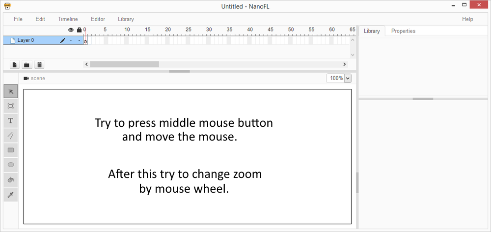
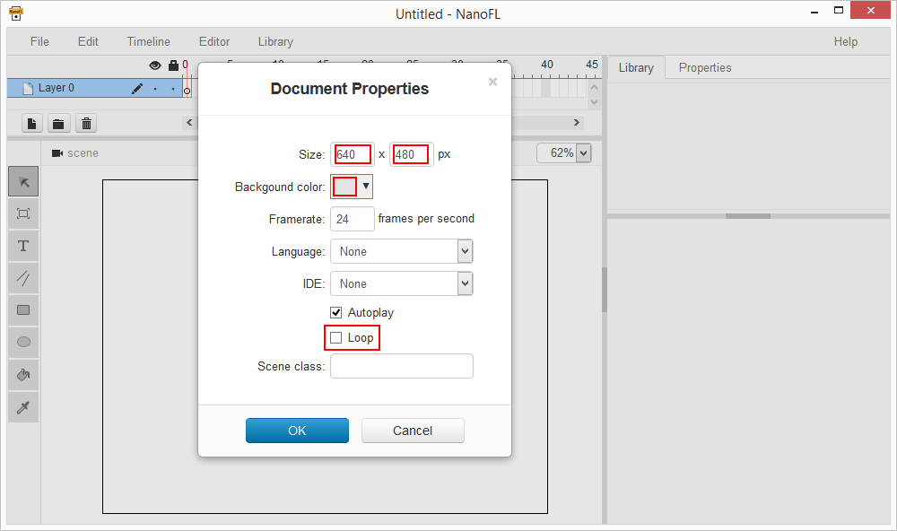
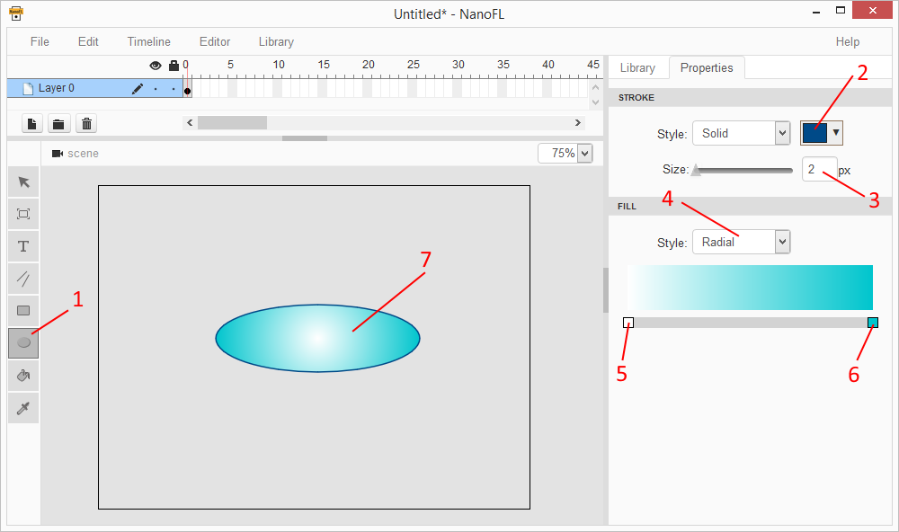
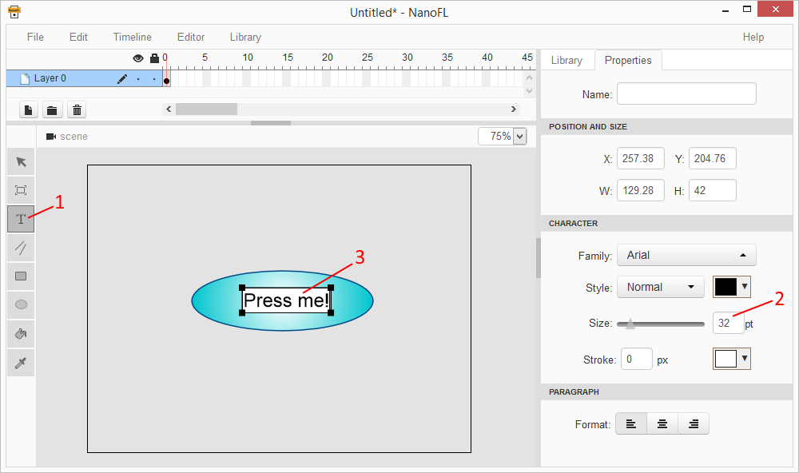
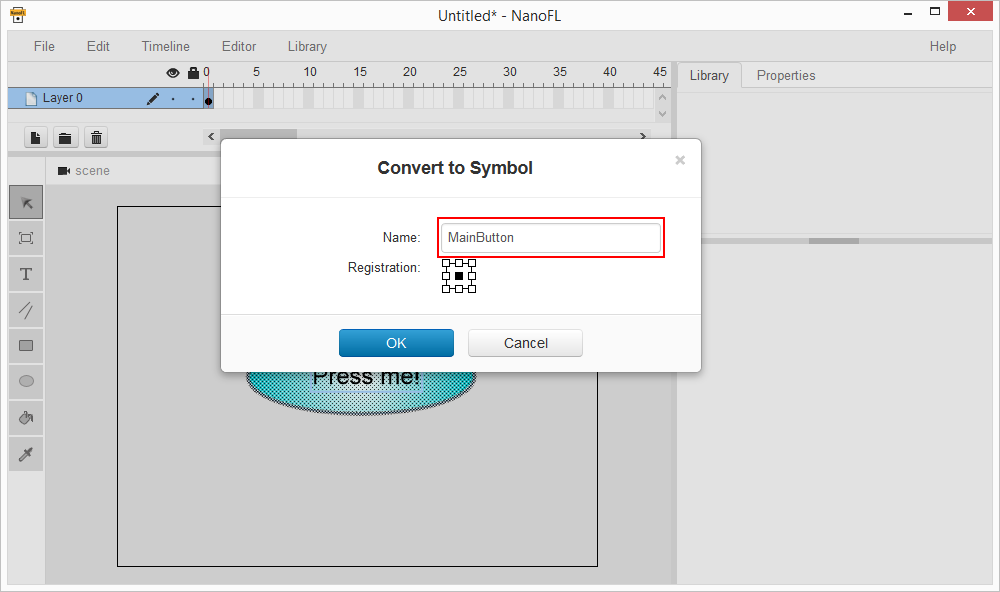
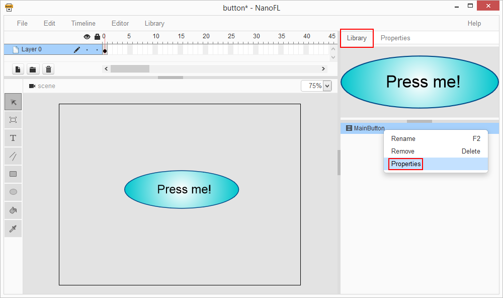
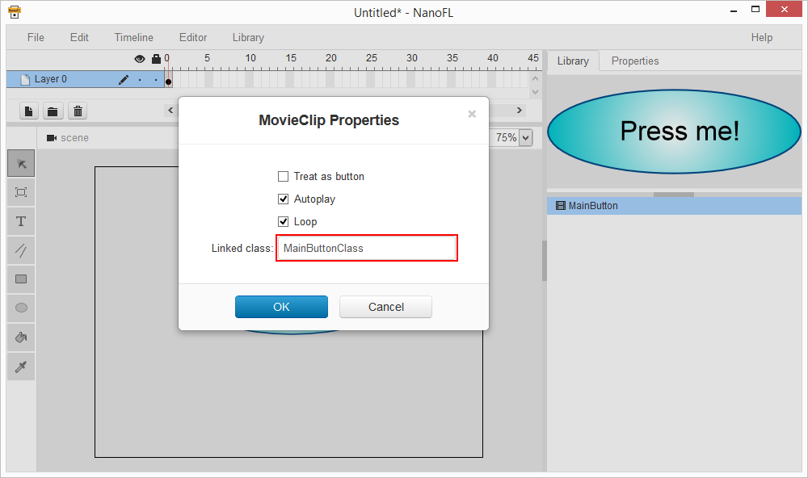
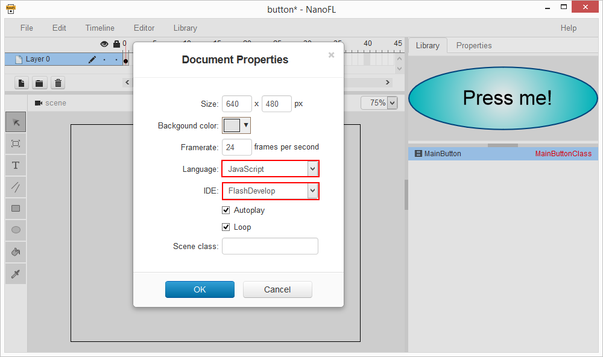
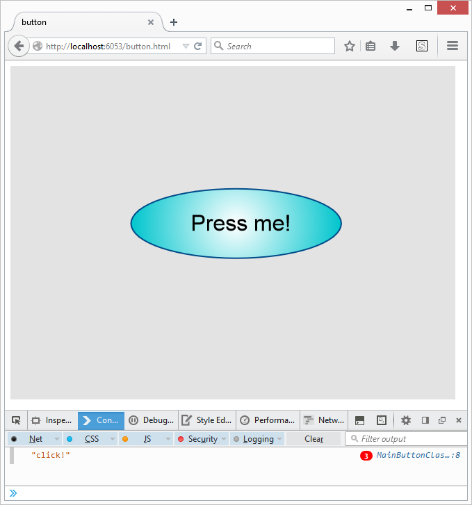

# Quick Start

Here we create a simple application: just button on the screen.
Click on that button will log a message to the browser console.

First of all, run NanoFL and look at the screen:

You can move and zoom view with mouse on any active tool.

One thing before drawing: specify document properties. Use main menu: **File** / **Properties**:

Change size to 640 x 480, select gray background and uncheck "Loop" as shown at picture above. Click "OK" button and we will ready to start drawing.

Now let to draw a button background. Click on toolbar's **Oval Tool** and select stroke/fill properties:

If you want to redraw oval, just press **A** to select all and **Delete** to remove selected graphics.

We are ready to add text. Click on **Text Tool** at the left toolbar and click on the desired position on the scene to add text area:


Switch to select mode (click on **Select Tool** toolbar button) and try to select objects on the scene by clicking them.
Use left mouse button to move objects to desired places.

Let convert our object to symbol. Select all by pressing **A** and press **F8**:


Graphics part are done. Below we add onClick action. At first, select **Properties** from symbol context menu:


And specify attached class name:


Open **Document Properties** again and select desired language and IDE:


At this point we need to save our document. Press **Ctrl+S** or select **File / SaveAs** in the main menu.

Now press Ctrl+Enter or select **File / Test** from the main menu. NanoFL runs your default browser with created document.
In future, after changing you graphics you may just save document and update that page in your browser to view changes.

Check saved file path. NanoFL create folder (in my case I save as "button", so folder named "button") for our document.
Let look into created folder:
	
* **bin** - store compiled library version (generated on save) and result javascript file for none-js languages (generated by your code IDE);
* **gen** - generated source code files (base classes and NanoFL helpers; generated on save);
* **library** - our document's library (contain movie clips, bitmaps, fonts and sounds);
* **src** - store source code files (NanoFL generate template files for attached classes on save);
* **button.fdproj** - here: FlashDevelop project file (if you choose other language/IDE you will see other files; generated on save);
* **button.html** - open this file in browser to view result (this file regenerated on save only if it not exists or you do not choose any language, so if you select language then you can manually edit this file for your needs);
* **button.nfl** - NanoFL document file (open it in NanoFL to edit graphics).

WARNING: Chrome browser has some restrictions for html files opened locally.
To avoid this, use NanoFL's **Test** command to open result html file through web server.

Open code project file in your IDE. Depends on your language, you need to do slightly different work:
	

##JavaScript
Add **onMouseDown** method into **MainButtonClass.js**:
```
MainButtonClass.prototype = $extend(base.MainButtonClass.prototype,
{
	onMouseDown: function(e)
	{
		console.log("click!");
	}
});
```
Ensure `<script src="gen/base.js"></script>` and `<script src="src/MainButtonClass.js"></script>` are present in **button.html**.
If not then delete **button.html** and save project from NanoFL. File **button.html** will be generated again.
NanoFL add into it links to all scripts from **gen** and **src** folders.


##TypeScript
Add **onMouseDown** method into **MainButtonClass.ts**:
```
class MainButtonClass extends base.MainButtonClass
{
	onMouseDown(e:createjs.MouseEvent)
	{
		console.log("click!");
	}
}
```
Compile your project.


##Haxe
Add **onMouseDown** method into **MainButtonClass.hx**:
```
class MainButtonClass extends base.MainButtonClass
{
	override function onMouseDown(e:createjs.MouseEvent)
	{
		trace("click!");
	}
}
```
Compile your project.

##All done!
Use **Test** command to open button.html in your browser!
Open browser console and try to click on button:


[Edit this page at bitbucket](https://bitbucket.org/nanofl/site/src/default/docs/quick_start/index.md)