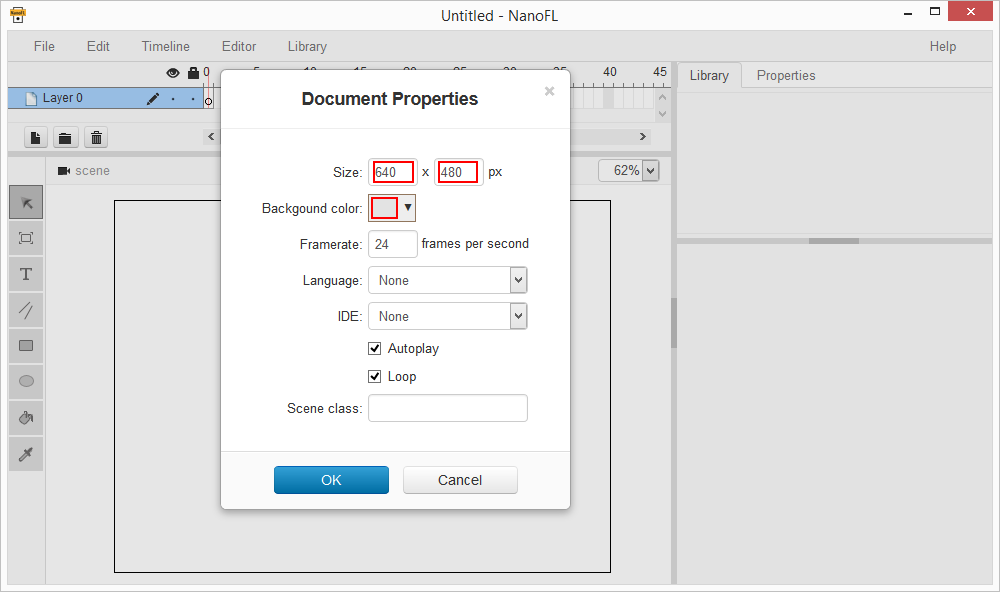

# Quick Start

Here we create a simple application: just button on the screen.
Click on that button will log a message into the browser console.

First of all, run NanoFL and look at the screen:
	


You can move and zoom view with mouse on any active tool.

One thing before drawing: specify document properties. Use main menu **File** / **Properties**:
	


Change size to 640 x 480 and select gray background as shown at picture above. Click "OK" button and we will ready to start drawing.

Now let to draw a button background. Click on toolbar's **Oval Tool** and select stroke/fill properties:


If you want to redraw oval, just press **A** to select all and **Delete** to remove selected graphics.

We are ready to add text. Click on **Text Tool** at the left toolbar and click on the desired position on the scene to add text area:


Switch to select mode (click on **Select Tool** toolbar button) and try to select objects on the scene by clicking them.
Use left mouse button to move objects to desired places.

Let convert our object to symbol. Select all by pressing **Ctrl+A** and press **F8**:


Graphics part are done. Now, right click on the **MainButton** symbol in the Library and select **Open Code**.

##Haxe code
Add **onMouseDown** method into **MainButtonClass.hx**:
```
class MainButtonClass extends base.MainButtonClass
{
	override function onMouseDown(e:createjs.MouseEvent)
	{
		if (hitTest(e.localX, e.localY))
		{
			trace("click!");
		}
	}
}
```

At this point we need to save our document. Press **Ctrl+S** or select **File / SaveAs** in the main menu.

Let look into created folder:
	
* **gen** - generated source code files (base classes and NanoFL helpers);
* **library** - our document's library (contains movie clips, bitmaps, fonts and sounds);
* **src** - store your source code files;
* **button.nfl** - NanoFL document file.

Compile and run your project by selecting **File / Test** command from the main menu (or press Ctrl+Enter).
After compilation, NanoFL generate "button.release" folder contains result files.
"index.html" in that folder is the start point of your application. NanoFL runs your default browser with that file.

WARNING: Chrome browser has some restrictions for html files opened locally.
To avoid this, use NanoFL's **Test** command to open result html file through embedded web server.

##All done!
Open browser console and click on the button:


Source code of the created application: [link](https://bitbucket.org/nanofl/examples/src/default/button/).

----------------------------------------------------------------------------------------------------

<a href="https://bitbucket.org/nanofl/site/src/default/docs/quick_start/index.md" target="_blank">Edit this page at bitbucket</a>