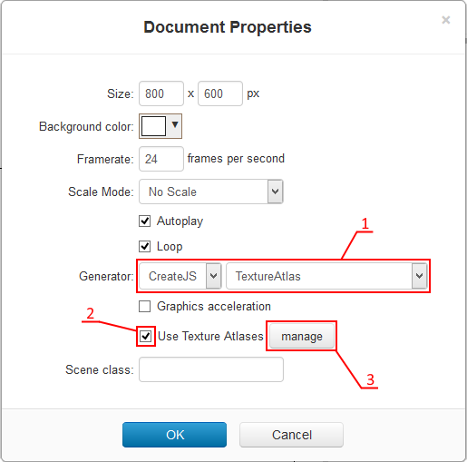
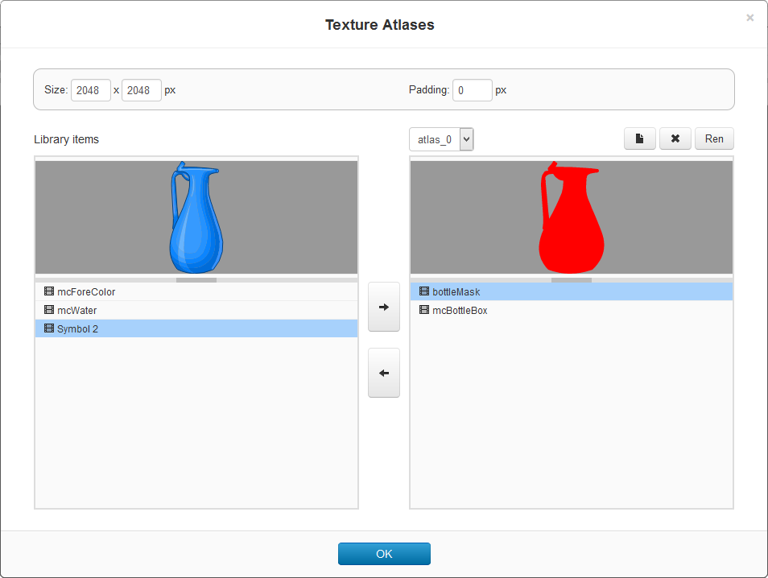
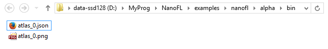

# Texture Atlases

NanoFL has a texture atlases support for using in **generator** plugins.
To use this feature:

1. Open **Document Properties** popup, select generator with atlases support and check **Use Texture Atlases**:
   

2. Click on **manage** button and arrange library symbols on atlases:
   

3. Save your document and look at your files: selected generator produce atlas in its format (usually, json and image files):
   

-------------------------------------------------------------------------------------------------------------------------------------
Edit <a href="https://bitbucket.org/nanofl/site/src/default/docs/texture_atlases/index.md" target="_blank">this page</a> at bitbucket
